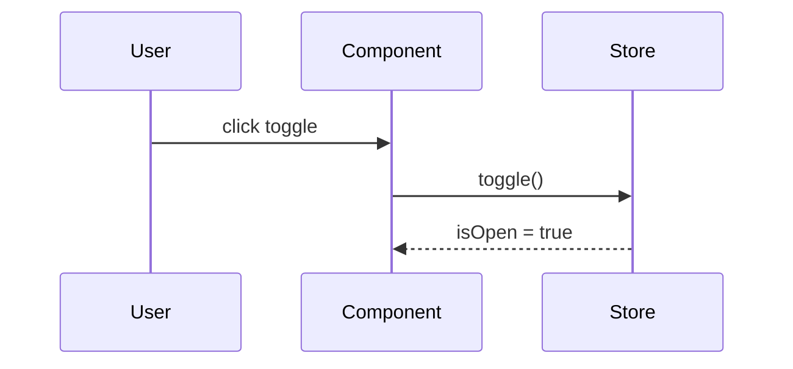

# <ComponentName> – Technical Spec
*Classification*: atom | molecule | organism | widget
*Author*: <name>
*Version*: 0.1
*Last updated*: <YYYY‑MM‑DD>
*Related Figma nodes*: <URL>

---

## 1 · Overview & Purpose
> One paragraph describing **what the component does** and **why it exists** in the product.

---

## 2 · Scope & Context
| Context | Details |
|---------|---------|
| **Parent areas / screens** | Where this component is used (list pages, other components). |
| **Dependencies** | Other internal components, external libraries, feature flags. |
| **Non‑goals** | Explicitly state what is **out of scope** (e.g., "does not fetch data itself"). |

---

## 3 · Functional Requirements
List **all** functional behaviors from the **user's point of view**.
- Must be **exhaustive** — capture every functional requirement of the component.
- Write in **natural, human-readable, user-centric language**, describing observable behavior understandable by both technical and non-technical stakeholders (developers, PMs, QA, product owners, etc.).
- Break down requirements so they can be used as complete context when creating user stories.

---

## 4 · Non-Functional Requirements
List **all** non-functional requirements relevant to the component.
- Must be **exhaustive**, covering all reconciled UX behaviors from **Figma + UX behavior data** (not raw UX behavior file).
- Include visual, interaction, accessibility, performance, and theming requirements that are **not** strictly functional but impact the user experience.
- Ensure descriptions are clear and understandable to both technical and non-technical stakeholders.

*Example:*
- Transition animations between sidebar states use a `200 ms` ease-in-out curve.
- Component fully supports high-contrast theme mode without loss of usability.

---

## 5 · Data Model & Types
```ts
// Paste exact TypeScript interfaces or Zod schemas
export interface FooProps { /* … */ }
```
*Guidelines*
- **Atoms**: just `Props` interface.
- **Widgets / organisms**: include local Zustand state shape and React‑Query hook types.

---

## 6 · API Contract (if applicable)
| Method | Endpoint | Payload in | Payload out | Notes |
|--------|----------|-----------|-------------|-------|
| GET | `/api/filters` | – | `FilterSystemConfig` | Cached via React Query key `['filters','config']` |

Include **mock examples** inside `json` code blocks.

---

## 7 · State Management
Describe:
1. **Local UI state** (e.g., open/closed, selected tab) → keep in component via `useState`.
2. **Global app state** → store name, shape, and typical mutations.

```ts
// Example
type SidebarStore = {
  isOpen: boolean;
  toggle(): void;
};
```

---

## 8 · Component Structure & File Layout
```
/src/components/<layer>/<ComponentName>/
  <ComponentName>.tsx
  <ComponentName>.types.ts
  <ComponentName>.stories.tsx
  <ComponentName>.test.tsx
  <ComponentName>.md
  index.ts
```
- Note any generated files (e.g., `*.g.tsx`) or co‑located assets.

---

## 9 · Props / Slots / Events
| Prop / Slot | Type | Required | Default | Description |
|-------------|------|----------|---------|-------------|
| `size` | `'sm' \| 'md' \| 'lg'` | no | `'md'` | Visual size preset |

---

## 10 · Theming & Styling
- **Tokens used**: list semantic tokens (`primary`, `chartBullish`, …).
- **Wrapper used**: `AppButton`, `AppText`, etc.
- If you add new tokens, update `/docs/token‑mappings.md` and follow `/docs/reshaped-theming-best-practices.md`.

---

## 11 · Interaction & Flows

- Include hover/focus states, keyboard shortcuts, ARIA roles.

---

## 12 · Performance & Accessibility
| Concern | Guideline |
|---------|-----------|
| Lazy‑loading | `React.lazy` + `<Suspense>` |
| A11y | Contrast ≥ 4.5 : 1, `role="navigation"` |

---

## 13 · Testing Strategy
- **Unit**: what to assert (render, props, callbacks).
- **Integration**: e.g., Zustand updates reflected in UI.
- **Mocking**: mention MSW handlers if API involved.

---

## 14 · Mock Data / Fixtures
```json
{
  "advancedFilters": [
    { "id": "currency", "values": { "selected": "eur" } }
  ]
}
```
- Point to `/mocks/<file>.ts` generators.

---

## 15 · Future Enhancements
- Saving presets to user profile
- SignalR live updates

---

## 16 · References
- `reshaped-theming-practices.md`
- `ai-optimized-fe-practices.md`
- "E | Advanced Filters | LLD | Engine – Feature & Mock API"
- "FE | Advanced Filters | LLD | UI and Data Structure"

---

### How to fill
1. **Stay factual**—copy exact types, tokens, endpoints.
2. **Use fenced blocks** for code (`ts`, `json`, `mermaid`).
3. **Leave "N/A"** if a section genuinely doesn't apply; never delete a heading.
